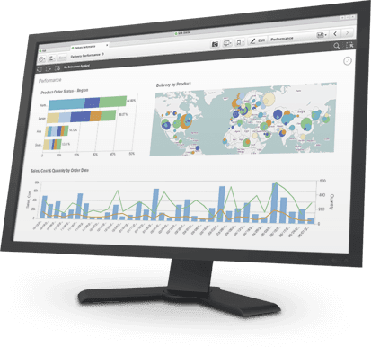

```{r setup, include=FALSE}
knitr::opts_chunk$set(echo = TRUE)
```

<center> <h1> <b> Bienvenidos </b> </h1> </center>

Esta charla está dirigida a un público que desean analizar, visualizar y modelar datos geográficos con software de código abierto. Usaremose software libre R, un lenguaje de programación estadística que tiene potentes capacidades de procesamiento de datos, visualización y geoespaciales. 

<span style="padding-left:30px">

<center></center>

<span style="padding-left:15px">

<center> <h2> <b> Quiénes necesitan geo-analítica? </b> </h2> </center>

<center></center>

<span style="padding-left:30px">

+ Las personas que han aprendido habilidades de análisis espacial utilizando un Sistema de Información Geográfica (SIG) de escritorio como *QGIS*, *ArcMap*, *GRASS* o *SAGA*, que desean hacer (geo) estadística y visualización de datos geográficos.

+ Estudiantes e investigadores graduados de campos especializados en datos geográficos, incluidos Geografía, Telecomunicación, Planificación, SIG y Ciencia de datos geográficos.

+ Académicos y estudiantes de posgrado que trabajan en proyectos en campos que incluyen Geología, Biología y Ecología, Ciencias Agrícolas (agricultura de precisión), Arqueología, Epidemiología, Modelado de Transporte y Ciencia de Datos, que requieren el poder y la flexibilidad de R para su investigación.

+ Investigadores y analistas aplicados en organizaciones públicas, privadas que necesitan la reproducibilidad, la velocidad y la flexibilidad de un lenguaje como R para aplicaciones que tratan con datos espaciales como la Planificación Urbana y de Transporte, Logística, Geo-marketing ( análisis de ubicación de la tienda) y planificación de emergencia.

<center></center>

<div class="definition_box">
<i> Si una imagen vale más que mil palabras, entonces un buen mapa vale al menos el doble </i>
</div>

<center></center>