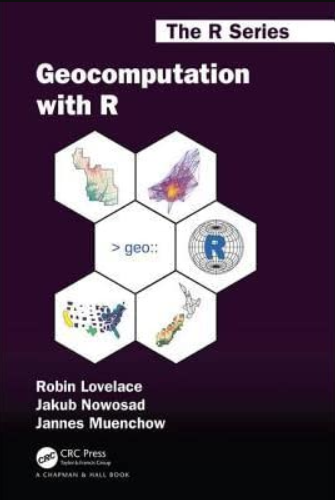

```{r setup, include=FALSE}
knitr::opts_chunk$set(echo = TRUE)
```

<center> <h1> <b> Qué es geocomputación? </b> </h1> </center>

<span style="padding-left:30px">

<center></center>


<span style="padding-left:30px"> 

Geocomputación es un término joven, que se remonta a la primera conferencia sobre el tema en 1996. Lo que distingue a la geocomputación del término 'geografía cuantitativa' comunmente utilizado, es su énfasis en las aplicaciones "creativas y experimentales". (Longley et al. 1998) y el desarrollo de nuevas herramientas y métodos (Openshaw y Abrahart 2000): *“GeoComputation trata sobre el uso de los diferentes tipos de geodatos y sobre el desarrollo de geo-herramientas relevantes dentro del contexto general de un enfoque 'científico'"*.

<span style="padding-left:30px">

<center> <h2> <b> ¿Por qué usar R para geocomputación? </b> </h2> </center>

<center></center>

<span style="padding-left:30px">

+ Hoy en día la cantidad de datos geográficos es muy grande. Cada teléfono inteligente tiene un receptor de posicionamiento global (GPS) y una multitud de sensores en dispositivos que van desde satélites y vehículos semiautónomos. Un vehículo autónomo, por ejemplo, puede generar 100 GB de datos por día (The Economist 2016).

+ Esta **"revolución de los geodatos"** impulsa la demanda de hardware informático de alto rendimiento y software eficiente y escalable para manejar y extraer información de los mismos. 

+ Las bases de datos espaciales permiten el almacenamiento y la generación de subconjuntos manejables a partir de los grandes almacenes de datos geográficos, lo que hace que las interfaces para obtener conocimiento de ellos sean herramientas vitales para el futuro.

+ **R** es una de esas herramientas, con capacidades avanzadas de análisis, modelado y visualización. 

+ **R** es un entorno y lenguaje de código abierto multiplataforma para computación estadística y gráficos (r-project.org/). Con una amplia gama de paquetes, R también admite estadísticas, modelado y visualización geoespaciales avanzadas. Los nuevos entornos de desarrollo integrados (IDE) como RStudio han hecho que R sea más fácil de usar para muchos, facilitando la creación de mapas con un panel dedicado a la visualización interactiva.


<span style="padding-left:30px">

<center> <h2> <b> Librerías para datos geográficos en R </b> </h2> </center>

<center></center>

<span style="padding-left:30px">

Al igual que muchas áreas de desarrollo de software, el ecosistema espacial de R está evolucionando rápidamente. Debido a que R es de código abierto, estos desarrollos pueden basarse fácilmente en trabajos previos, **"poniéndose sobre los hombros de gigantes"**, como lo expresó Isaac Newton en 1675. Este enfoque es ventajoso porque fomenta la colaboración y evita **"reinventar la rueda"**. 


<span style="padding-left:30px">

+ **rgdal**, lanzado en 2003, proporcionó enlaces GDAL para R que mejoraron en gran medida su capacidad de importar datos de formatos de datos geográficos que antes no estaban disponibles.


+ **sp**, lanzado en 2005, superó la incapacidad de R para distinguir objetos espaciales y no espaciales (Pebesma y Bivand 2005). Antes de 2005, las coordenadas geográficas generalmente se trataban como cualquier otro número. 

+ **sp** cambió esto con sus clases y métodos genéricos que admiten puntos, líneas, polígonos y cuadrículas y datos de atributos.

+ Mientras que rgdal y sp resolvieron muchos problemas espaciales, R aún carecía de la capacidad de realizar operaciones geométricas. Colin Rundel abordó este problema desarrollando **rgeos**, una interfaz R para la biblioteca de geometría de código abierto (GEOS) durante un proyecto Google Summer of Code en 2010 (Bivand y Rundel 2018). 

+ **raster**, lanzado por primera vez en 2010 (Hijmans 2017),la característica clave es su capacidad para trabajar con conjuntos de datos que son demasiado grandes para caber en la RAM (la interfaz de R con PostGIS admite operaciones fuera del disco en datos geográficos vectoriales). raster también admite álgebra de mapas.

+ **ggmap** amplió las capacidades espaciales de ggplot2 (Kahle y Wickham 2013), al facilitar el acceso a los mosaicos de "mapa base" desde servicios en línea como Google Maps. 

A partir de 2018, la creación de mapas en R es un tema en boga con paquetes dedicados como tmap, leaflet y mapview que admiten el sistema de clases proporcionado por sf.

<center> <h2> <b> Ejemplo 1. </b> </h2> </center>

*Calentando motores...*


```{r eval=T,message=FALSE, warning=FALSE}
rm(list=ls())
options(java.parameters="-Xmx8000m")
memory.size(max=T)

library(raster)
ProvinciasEcuador <- getData("GADM",country="ECU",level=1) # provincias

class(ProvinciasEcuador)

#View(ProvinciasEcuador)
```

<center></center>


```{r eval=T}
plot(ProvinciasEcuador)
```


Añadiendo etiquetas, fijando el tamaño del mapa y por tando de sus elementos (polígonos) y de los centroides:

```{r eval=T}
Provincias <-ProvinciasEcuador$NAME_1
Provincias
xlim <- ProvinciasEcuador@bbox[1,]
xlim
ylim <- ProvinciasEcuador@bbox[2,]
ylim
```

```{r eval=T,message=FALSE, warning=FALSE}
Provincias <-ProvinciasEcuador$NAME_1
Provincias
xlim <- ProvinciasEcuador@bbox[1,]
xlim
ylim <- ProvinciasEcuador@bbox[2,]
ylim

centroides<-coordinates(ProvinciasEcuador)
centroides

paleta<-rainbow(length(ProvinciasEcuador), alpha = 0.6) # colores de cada poligono
paleta

par(bg="lightblue3")
plot(0, 0, type="n", ann=FALSE, axes=FALSE)
par(new=TRUE)

plot(ProvinciasEcuador, xlim=xlim, ylim=ylim,col=paleta, main="Mapa de las provincias del Ecuador")
text(centroides,Provincias,cex=0.45)

# creo una columna numerica 
ProvinciasEcuador$DatoNumerico = round(runif(length(ProvinciasEcuador), min=1, max=100),1) # dato numerico aleatorio, podria ser el dato que ustedes quieren mapear
ProvinciasEcuador$DatoNumerico 

ProvinciasEcuador$Color=heat.colors(length(Provincias))

data.frame("Provincia"=ProvinciasEcuador$NAME_1,"DatoNumerico"=ProvinciasEcuador$DatoNumerico, Color=heat.colors(length(Provincias)))

plot(ProvinciasEcuador, xlim=xlim, ylim=ylim,col=ProvinciasEcuador$Color, main="Mapa de las provincias del Ecuador")
text(centroides,as.character(ProvinciasEcuador$DatoNumerico),cex=0.5)

# creo una columna categorica
ProvinciasEcuador$DatoCategorico = c(rep("A",6),rep("B",8),rep("C",10)) # dato categorico, podria ser el dato que ustedes quieren mapear
ProvinciasEcuador$DatoCategorico 

ProvinciasEcuador$Color2[ProvinciasEcuador$DatoCategorico=="A"] <- "pink"
ProvinciasEcuador$Color2[ProvinciasEcuador$DatoCategorico=="B"] <- "cyan"
ProvinciasEcuador$Color2[ProvinciasEcuador$DatoCategorico=="C"] <- "violet"


data.frame("Provincia"=ProvinciasEcuador$NAME_1,"DatoCategorico"=ProvinciasEcuador$DatoCategorico, Color=ProvinciasEcuador$Color2)

plot(ProvinciasEcuador, xlim=xlim, ylim=ylim,col=ProvinciasEcuador$Color2, main="Mapa de las provincias del Ecuador")
text(centroides,Provincias,cex=0.45)

legend("bottomleft", 
       legend = c("A", "B","C"), 
       col = c("pink","cyan","violet"),
       pch = 19,
       title="Variable categorica", bg='white'
       )

# que tal si queremos filtrar gategorias
# similar es el metodo para filtrar valores numericos

par(bg="white")
plot(0, 0, type="n", ann=FALSE, axes=FALSE)
par(new=TRUE)
plot(ProvinciasEcuador, xlim=xlim, ylim=ylim, main="Mapa de las provincias del Ecuador",)
plot(ProvinciasEcuador[ProvinciasEcuador$DatoCategorico=="A",], xlim=xlim, ylim=ylim,col=ProvinciasEcuador$Color2[ProvinciasEcuador$DatoCategorico=="A"], add=T)
text(centroides,Provincias,cex=0.45)

legend("bottomleft", 
       legend = c("A", "B","C"), 
       col = c("pink","cyan","violet"),
       pch = 19,
       title="Variable categorica", bg='white'
)


#Podemos descargar la misma informacion para cantones y parroquias

CantonesEcuador <- getData("GADM",country="ECU",level=2) # cantones
CantonesEcuador

xlim2 <- CantonesEcuador@bbox[1,]
ylim2 <- CantonesEcuador@bbox[2,]

centroides2 <- coordinates(CantonesEcuador)
centroides2

Cantones <- CantonesEcuador$NAME_2
Cantones
ParroquiasEcuador <- getData("GADM",country="ECU",level=3) # parroquias
ParroquiasEcuador

xlim3 <- ParroquiasEcuador@bbox[1,]
ylim3 <- ParroquiasEcuador@bbox[2,]

centroides3 <- coordinates(ParroquiasEcuador)
centroides3

Parroquias <- ParroquiasEcuador$NAME_3
Parroquias
```

Qué tal si queremos mostrar un mapa dinámico, avanzamos al siguiente ejemplo.

<center> <h2> <b> Ejemplo 2. </b> </h2> </center>

*Mapas dinámicos con Highcharter*

La función hcmap nos permite crear mapas dinámicos de forma muy fácil, únicamente debemos seleccionar un mapa (url) de la colección highmaps y usarlo con nuestros datos y personalización deseada.

La función se encarga de descargar el mapa (tipo lista) y genera el gráfico.

Ahora grafiquemos el mapa de Ecuador con la población por provincia de acuerdo a los datos del Censo de Población de 2010 del INEC, los cuales hemos cargado previamente en nuestro repositorio y traemos directamente con:

```{r eval=T,message=FALSE, warning=FALSE}
library(highcharter)
library(rjson)
library(stringr)
library(dplyr)

ecuador <- fromJSON(file = "https://raw.githubusercontent.com/Rusersgroup/mapa_ecuador/master/ec-all.geo.json")

  
  load(url("https://raw.githubusercontent.com/Rusersgroup/mapa_ecuador/master/poblacion_provincia_ecuador_2010.Rdata"))
glimpse(poblacion_provincia_ecuador_2010)

highchart() %>%
  hc_title(text = "<i>Mapa dinámico de Ecuador</i>",
           margin = 20, align = "center",
           style = list(color = "#08338F", useHTML = TRUE)) %>% 
  hc_subtitle(text = "Población por provincia",
              align = "center",
              style = list(color = "#0C5C9E", fontWeight = "bold")) %>% 
  hc_tooltip(followPointer =  FALSE) %>%
  hc_add_series_map(ecuador, poblacion_provincia_ecuador_2010, name = "Población",
                    value = "Poblacion", joinBy = c("name", "Provincia"),
                    dataLabels = list(enabled = TRUE,
                                      format = '{point.properties.woe-name}')) %>%
  hc_colorAxis(minColor = "#B7D4EB", maxColor = "#08338F")  %>%
  hc_legend(align = "center", x = 0, y = -70) %>%
  hc_mapNavigation(enabled = TRUE) %>%
  hc_add_theme(hc_theme_ffx()) %>% 
  hc_add_annotation(xValue = 0, yValue = 0, title = list(text = 'Fuente: INEC')) %>% 
  hc_chart(borderColor = "#08338F",
           borderRadius = 10,
           borderWidth = 2)
```


Ahora podemos visualizar cada provincia.

```{r eval=T,message=FALSE, warning=FALSE}
Provincia <- as.character(poblacion_provincia_ecuador_2010$Provincia)
print(Provincia)

mapa_provincia <- function() {
  n <- round(runif(1,1,24))
  nombre_aux <- Provincia[as.numeric(n)]
  print(nombre_aux)

  provincia <- fromJSON(file = paste0("https://raw.githubusercontent.com/Rusersgroup/mapa_ecuador/master/Provincias/", nombre_aux, ".geo.json"))
  prov_data <- data.frame(Provincia=nombre_aux, Total=nchar(nombre_aux))
  
  highchart(type = "map") %>%
    hc_tooltip(followPointer =  FALSE) %>%
    hc_add_series_map(provincia, prov_data, name = "Total Procedimientos",
                      value = "Total", joinBy = c("name", "Provincia"),
                      dataLabels = list(enabled = TRUE,
                                        format = '{point.properties.name}')) %>%
    hc_legend(enabled=FALSE) %>%
    hc_mapNavigation(enabled = TRUE) %>%
    hc_add_theme(hc_theme_sandsignika())
}
mapa_provincia()

mapa_provincia()

mapa_provincia()

```
